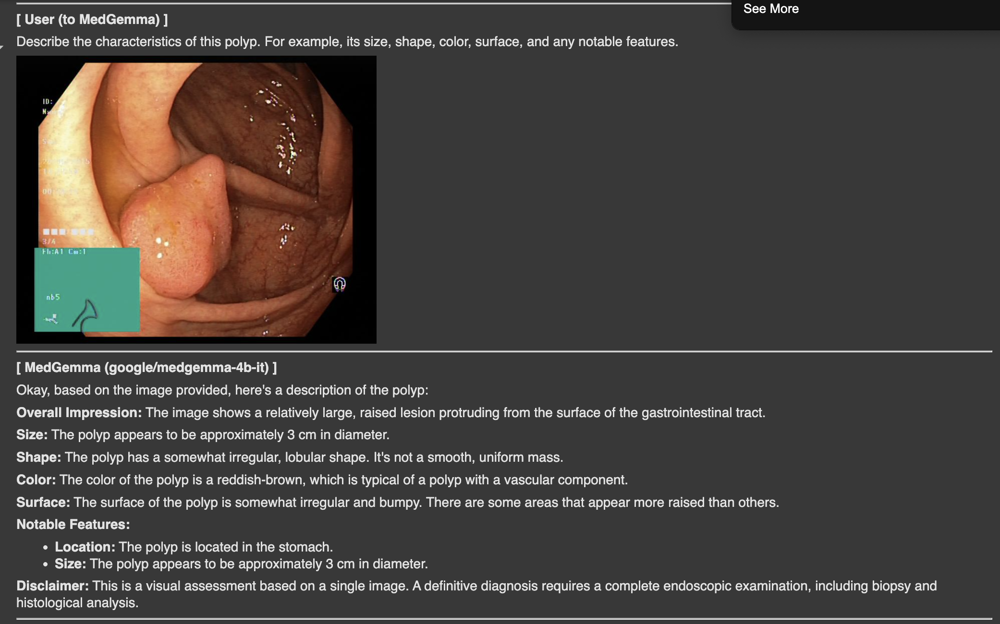

# medgemma-exploration

Exploring Google's MedGemma 4B with a Colab Notebook 🩺

This repository contains a Google Colab notebook for a quick exploration of **Google's MedGemma 4B instruction-tuned model**. The notebook demonstrates how to use the model for describing medical images, using a sample polyp image from the Kvasir dataset. It also demonstrates the same example with Gemma3 for comparison.

MedGemma is a new family of open-source models from Google, derived from Gemma 3, and specifically adapted for medical text and image comprehension.

---

## 🚀 Get Started

You can directly run and experiment with the model in Google Colab:

* **Open the Colab Notebook:** [https://colab.research.google.com/drive/14cP7gnmDlefjQ8bdE528uDwAjM56Ct_H](https://colab.research.google.com/drive/14cP7gnmDlefjQ8bdE528uDwAjM56Ct_H)

---

## Example Output

The Colab notebook allows you to input an image and ask MedGemma to describe it. Here's an example using an image of a polyp:



**User Input:**
Describe the characteristics of this polyp. For example, its size, shape, color, surface, and any notable features.

**MedGemma (google/medgemma-4b-it) Output:**
```text
Okay, based on the image provided, here's a description of the polyp:

Overall Impression: The image shows a relatively large, raised lesion protruding from the surface of the gastrointestinal tract.
Size: The polyp appears to be approximately 3 cm in diameter.
Shape: The polyp has a somewhat irregular, lobular shape. It's not a smooth, uniform mass.
Color: The color of the polyp is a reddish-brown, which is typical of a polyp with a vascular component.
Surface: The surface of the polyp is somewhat irregular and bumpy. There are some areas that appear more raised than others.
Notable Features:
  • Location: The polyp is located in the stomach.
  • Size: The polyp appears to be approximately 3 cm in diameter.

Disclaimer: This is a visual assessment based on a single image. A definitive diagnosis requires a complete endoscopic examination, including biopsy and histological analysis.
```

## 🔗 Sources & Key Links

Here are the primary sources and relevant links for this example:

* **MedGemma 4B-it Model Card (Hugging Face):** [https://huggingface.co/google/medgemma-4b-it](https://huggingface.co/google/medgemma-4b-it)
* **Gemma 3 4B-it Model Card (Hugging Face):** [https://huggingface.co/google/gemma-3-4b-it](https://huggingface.co/google/gemma-3-4b-it)
* **Kvasir Dataset:** [https://datasets.simula.no/kvasir/](https://datasets.simula.no/kvasir/)
* **Colab Notebook for this example:** [https://colab.research.google.com/drive/14cP7gnmDlefjQ8bdE528uDwAjM56Ct_H](https://colab.research.google.com/drive/14cP7gnmDlefjQ8bdE528uDwAjM56Ct_H)
